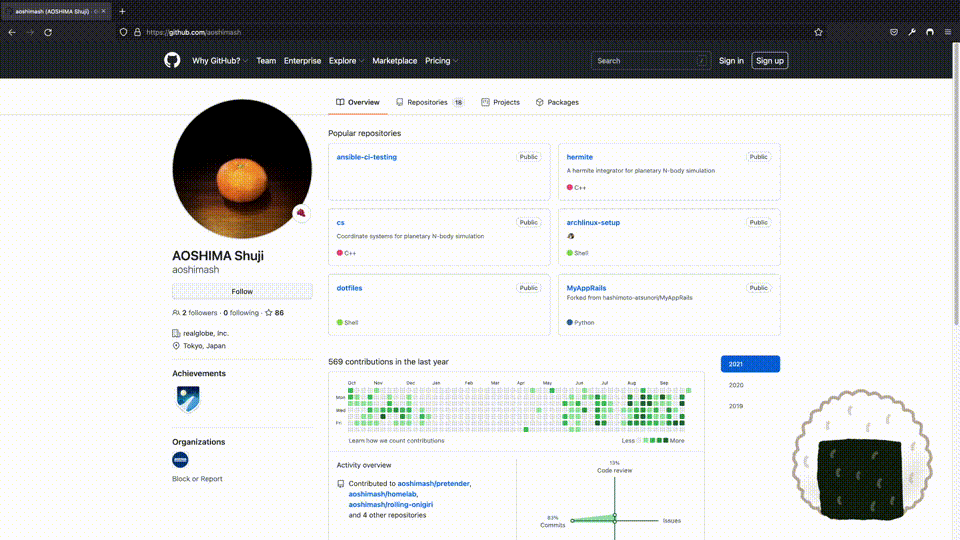
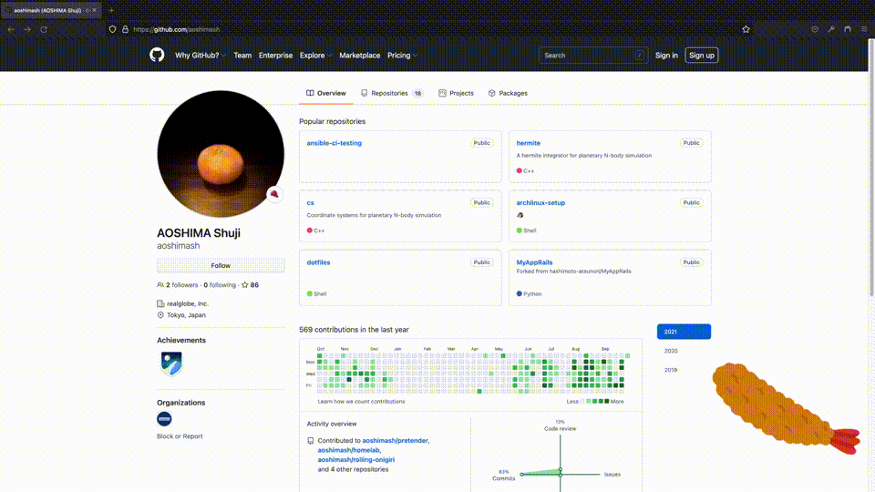

# rolling-onigiri

おにぎりが回るブラウザ拡張

	

エビフライモード

	

## 使い方

※ まだ開発途中なので Firefox の「一時的な拡張機能」としてしか動かない。今後 Chrome にも対応させたい。

「一時的な拡張機能」の読み込みはこちらを参照 https://developer.mozilla.org/ja/docs/Tools/about:debugging
